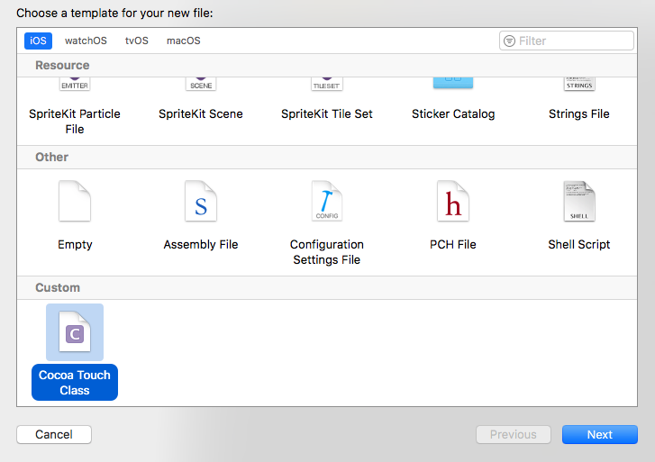
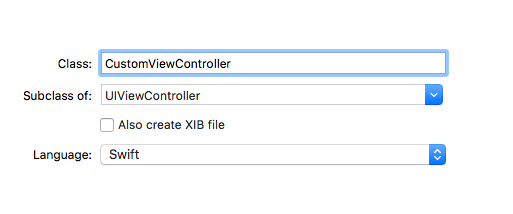
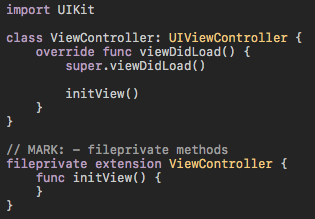

Xcode-Template
===========

[](https://developer.apple.com/iphone/index.action)
[](https://developer.apple.com/swift)
[](http://mit-license.org)

# Overview
This is a way to customize the default template when creating a new file with Xcode such as UIViewController.

# How to use
## 1. Deploy templates
Execute shell script and place custom template. If Xcode is open, restart it.

```
xcodeTemplate> chmod +x deploy_templates.sh
xcodeTemplate> ./deploy_templates.sh
```

## 2. Select templates
Select [File]-[New]-[File] and [Custom]-[Cocoa touch Class]



## 3. Creating new file
Create a class as a subclass of Cocoa Tocuh class. (ex. UIViewController)



## 4. Make sure the template is applied


# Customize templates
Modify `xcodeTemplate/Cocoa Touch Class.xctemplate/UIViewControllerSwift/___FILEBASENAME___.swift`.
After modification, you need to re-run the shell script.

To add other template classes, copy the directory of the class name you want to modify in `Applications/Xcode.app/Contents/Developer/Platforms/iPhoneOS.platform/Developer/Library/Xcode/Templates/File Templates/Source/Cocoa Touch Class.xctemplate` to `xcodeTemplate/Cocoa Touch Class.xctemplate` and modify it.

## Author

**R. Ayakix**

- Past works: [Product list](http://ayakix.com/) / [Waaaaay!](http://waaaaay.com/)
- Blogs: [English](https://medium.com/@Ayakix) / [Japanese](http://blog.ayakix.com/)
- Contact: [Twitter](https://twitter.com/ayakix)
